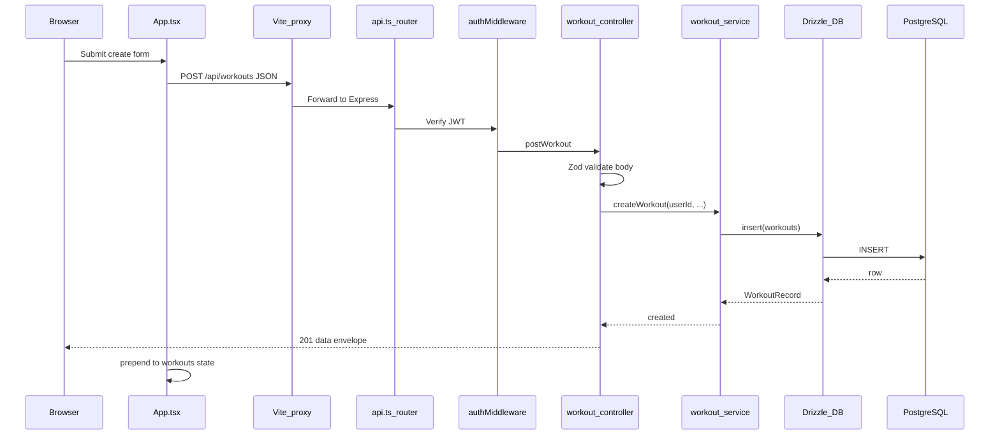

# App presentation guide

Use this document when **demoing or explaining** the CSCI441 Fitness Tracker: what each tier does, how they connect, and which **files** sit on the hot path for a typical request.

Deeper references: [`architecture.md`](architecture.md), [`app-startup-walkthrough.md`](app-startup-walkthrough.md), [`api-overview.md`](api-overview.md), [`project-structure.md`](project-structure.md).

---

## One-sentence pitch

A **React** single-page app talks to an **Express** JSON API over `/api`; the API validates requests, checks a **JWT**, and reads or writes **PostgreSQL** through **Drizzle ORM**—with workouts, exercises, and user preferences persisted in the database.

---

## Database (PostgreSQL)

**Role:** System of record for users, exercise catalog, workouts, and related domain tables.

**Where it is defined**

| Artifact                     | Path                                                                                                                                         | Purpose                                                                                                                          |
| ---------------------------- | -------------------------------------------------------------------------------------------------------------------------------------------- | -------------------------------------------------------------------------------------------------------------------------------- |
| Drizzle schema (TypeScript)  | [`server/db/schema.ts`](../server/db/schema.ts)                                                                                              | Tables/columns the ORM knows about; keep in sync with SQL                                                                        |
| Canonical SQL (local import) | [`database/schema.sql`](../database/schema.sql)                                                                                              | Full `DROP SCHEMA public` + recreate for greenfield local DBs                                                                    |
| Seed data                    | [`database/data.sql`](../database/data.sql)                                                                                                  | Initial exercise rows for import                                                                                                 |
| Migrations                   | [`database/migrations/`](../database/migrations/)                                                                                            | Incremental changes (e.g. `0004_workout_reps.sql`); journal in [`meta/_journal.json`](../database/migrations/meta/_journal.json) |
| Import + Drizzle baseline    | [`database/import.sh`](../database/import.sh), [`database/drizzle-baseline-after-import.sql`](../database/drizzle-baseline-after-import.sql) | After SQL import, marks migrations as applied so `pnpm run db:migrate` does not collide with existing tables                     |
| Connection + SSL             | [`server/db/pool.ts`](../server/db/pool.ts), [`server/config/env.ts`](../server/config/env.ts)                                               | `DATABASE_URL`, optional `DATABASE_SSL` (`auto` / `true` / `false`)                                                              |

**Core tables to mention**

- **`users`** — identity (`authSubject`, optional `email`/`passwordHash`), guest flag, display name, accessibility fields (`uiHighContrast`, `uiTextSize`), optional profile columns.
- **`exercise_types`** — catalog: global seeds (`userId` null) and per-user custom rows.
- **`workouts`** — per-user sessions: `title`, `notes`, optional `exerciseTypeId`, **`user_weight`**, **`reps`**, timestamps.
- **`exercises`**, **`goals`** — present in schema for richer modeling; the **demo UI** in `App.tsx` focuses on workouts + exercise catalog.

**Talking point:** “Schema is defined in Drizzle and mirrored in SQL; we migrate production-like DBs with Drizzle Kit, and the import script keeps the migration journal aligned for fresh clones.”

---

## Server (Node / Express)

**Role:** HTTP API, auth, validation, business rules, database access.

**Bootstrapping**

| File                                              | Role                                                                                                                                    |
| ------------------------------------------------- | --------------------------------------------------------------------------------------------------------------------------------------- |
| [`server/server.ts`](../server/server.ts)         | Loads env, builds app, listens on `PORT`                                                                                                |
| [`server/app.ts`](../server/app.ts)               | Helmet, CORS, static files, JSON body, rate limits, `/api` router, SPA fallback, [`errorMiddleware`](../server/lib/error-middleware.ts) |
| [`server/config/env.ts`](../server/config/env.ts) | Zod-validated env: `DATABASE_URL`, `DATABASE_SSL`, `TOKEN_SECRET`, `CORS_ORIGIN`, rate limits, etc.                                     |

**Request pipeline (layered)**

| Layer       | Location                                                                                       | Responsibility                                                                                                     |
| ----------- | ---------------------------------------------------------------------------------------------- | ------------------------------------------------------------------------------------------------------------------ |
| Routes      | [`server/routes/api.ts`](../server/routes/api.ts)                                              | Maps paths to handlers; attaches [`authMiddleware`](../server/lib/authorization-middleware.ts) on protected routes |
| Controllers | [`server/controllers/*.ts`](../server/controllers/)                                            | Parse params/body with **Zod**, call services, send [`sendSuccess`](../server/lib/http-response.ts) / errors       |
| Services    | [`server/services/*.ts`](../server/services/)                                                  | Ownership-aware queries (`userId` from JWT, not from body), inserts/updates                                        |
| DB access   | [`server/db/drizzle.ts`](../server/db/drizzle.ts), [`server/db/pool.ts`](../server/db/pool.ts) | Drizzle client over `pg` pool                                                                                      |

**Auth**

- JWT payload: `{ userId }` ([`auth-service.ts`](../server/services/auth-service.ts) `signAccessToken`).
- Middleware: [`server/lib/authorization-middleware.ts`](../server/lib/authorization-middleware.ts) verifies `Authorization: Bearer …` and sets `req.user`.

**Talking point:** “Controllers are thin; services own SQL shape and ownership; errors become a consistent JSON envelope.”

---

## Client (React / Vite)

**Role:** Login, preferences, exercise and workout CRUD; stores JWT in `localStorage` for the demo.

| File                                                                                            | Role                                                                                                                              |
| ----------------------------------------------------------------------------------------------- | --------------------------------------------------------------------------------------------------------------------------------- |
| [`client/index.html`](../client/index.html)                                                     | Shell; loads Lexend font                                                                                                          |
| [`client/src/main.tsx`](../client/src/main.tsx)                                                 | Mounts `<App />`; imports [`index.css`](../client/src/index.css) + [`styles/app-themes.css`](../client/src/styles/app-themes.css) |
| [`client/src/App.tsx`](../client/src/App.tsx)                                                   | Main UI: auth, hydrate (`/api/me`, `/api/exercises`, `/api/workouts`), forms, theme + font-size on `<html>`                       |
| [`client/src/lib/ui-preferences.ts`](../client/src/lib/ui-preferences.ts)                       | Theme IDs, text-size scale, `localStorage` read/write for theme                                                                   |
| [`client/src/lib/api-error.ts`](../client/src/lib/api-error.ts)                                 | Maps API error envelopes to user-visible messages (including validation details)                                                  |
| [`client/src/components/PreferencesCard.tsx`](../client/src/components/PreferencesCard.tsx)     | Segmented theme + text size controls                                                                                              |
| [`client/src/components/EmptyWorkoutState.tsx`](../client/src/components/EmptyWorkoutState.tsx) | Empty list CTA                                                                                                                    |
| [`client/vite.config.ts`](../client/vite.config.ts)                                             | Dev proxy: `/api` → `http://localhost:8080`                                                                                       |
| [`shared/api-contracts.ts`](../shared/api-contracts.ts)                                         | Shared TypeScript types for API envelopes                                                                                         |

**Talking point:** “In dev, the browser only talks to Vite; Vite proxies `/api` to the Express port. Production uses `VITE_API_BASE_URL` where applicable.”

---

## End-to-end data flow (example: create workout)

**Key files on this path**

1. [`client/src/App.tsx`](../client/src/App.tsx) — `fetchJson` + `POST` body (`title`, `notes`, `exerciseTypeId`, `userWeight`, `reps`).
2. [`server/routes/api.ts`](../server/routes/api.ts) — `apiRouter.post('/workouts', authMiddleware, postWorkout)`.
3. [`server/controllers/workout-controller.ts`](../server/controllers/workout-controller.ts) — `createWorkoutBody` Zod schema; calls service; `serializeWorkout`.
4. [`server/services/workout-service.ts`](../server/services/workout-service.ts) — `insert(workouts).values({...}).returning()`.
5. [`server/db/schema.ts`](../server/db/schema.ts) — `workouts` table definition.

**Parallel example (read list):** `GET /api/workouts` uses the same router → `getWorkouts` → `listWorkouts(userId)` → `select().from(workouts).where(...)`.

---

## Suggested demo order (about 5 minutes)

1. **Stack** — Browser → Vite proxy → Express → Postgres; show folder roots `client/`, `server/`, `database/`.
2. **DB** — Open `server/db/schema.ts` and point at `users`, `exercise_types`, `workouts` (weight + reps).
3. **Server** — Open `server/routes/api.ts` then one controller + matching service for a single route.
4. **Client** — Open `App.tsx`: token hydrate, then create workout (title + weight + reps).
5. **Optional** — `PreferencesCard` + `data-app-theme` in DevTools on `<html>`.

---

## Checklist before presenting live

- `pnpm run dev` (client + server) or deployed URLs ready.
- Database migrated (`pnpm run db:seed` for demo user / exercises).
- Browser: `http://localhost:5173`, API health `http://localhost:8080/api/health`.

If something fails during the demo, use [`troubleshooting.md`](troubleshooting.md) (especially DB migrate / import / workout create sections).
