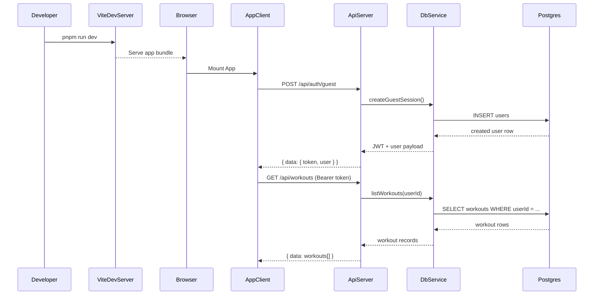

# App Startup Walkthrough

This guide explains what happens from `pnpm run dev` to the first successful workout request.

## Preconditions

- Dependencies installed (`pnpm install`)
- `server/.env` configured (`DATABASE_URL`, `TOKEN_SECRET`, `CORS_ORIGIN`)
- PostgreSQL running
- Database initialized: `pnpm run db:import`, then `pnpm run db:migrate`, then `pnpm run db:seed` (see root [`README.md`](../README.md) — import runs a Drizzle baseline so migrate applies cleanly)

## 1) Start Development Processes

```sh
pnpm run dev
```

This starts:

- `pnpm -C client dev` (Vite, usually `http://localhost:5173`)
- `pnpm -C server dev` (Express API, usually `http://localhost:8080`)

## 2) Server Bootstrap

Boot path:

1. `server/server.ts` loads environment values from `server/config/env.ts`.
2. `server/app.ts` builds middleware stack:
   - `helmet`
   - `cors`
   - static file serving
   - request logging
   - JSON body parsing
   - rate limiting
   - `/api` routing
   - fallback route
   - centralized `errorMiddleware`
3. API starts listening on `PORT`.

## 3) Client Bootstrap

1. Browser opens `http://localhost:5173`.
2. `client/src/main.tsx` mounts `<App />`.
3. `client/src/App.tsx` checks local token and decides:
   - show login screen (no token), or
   - hydrate authenticated state (`/api/me`, `/api/exercises`, `/api/workouts`).

## 4) First Authenticated Flow

Typical first run:

1. User clicks `Continue as guest`.
2. Client calls `POST /api/auth/guest`.
3. Server creates guest user, signs JWT, returns token + user payload.
4. Client stores token and loads:
   - `GET /api/me`
   - `GET /api/exercises`
   - `GET /api/workouts`
5. UI renders profile + accessibility controls + workout/exercise sections.

## Startup Sequence



## 5) Backend Request Path Example (`GET /api/workouts`)

1. Express receives `GET /api/workouts`.
2. Router applies `authMiddleware` then `getWorkouts`.
3. Controller reads caller user with `requireUserId(req)`.
4. Service queries workouts filtered by `userId`.
5. Response uses standard envelope (`data` + `meta.requestId`).

## 5b) Create workout path (`POST /api/workouts`)

1. Browser submits the create form from [`client/src/App.tsx`](../client/src/App.tsx) with JSON including `title`, optional `notes` / `exerciseTypeId`, and required **`userWeight`** / **`reps`**.
2. [`server/routes/api.ts`](../server/routes/api.ts) routes to `postWorkout` behind `authMiddleware`.
3. [`server/controllers/workout-controller.ts`](../server/controllers/workout-controller.ts) validates the body with Zod, then calls `createWorkout`.
4. [`server/services/workout-service.ts`](../server/services/workout-service.ts) inserts into `workouts` via Drizzle ([`server/db/schema.ts`](../server/db/schema.ts)).
5. Serialized workout JSON includes `userWeight` (string) and `reps` (number or `null` on legacy rows).

## 6) Ownership Rule

Protected mutations never trust caller-provided user IDs.  
Ownership is enforced in service queries using the authenticated `req.user.userId`.

## 7) Debug Checklist

If startup or requests fail:

1. Confirm `pnpm run dev` is running.
2. Check API endpoints:
   - `http://localhost:8080/api/health`
   - `http://localhost:8080/api/ready`
3. Confirm auth route works (`POST /api/auth/guest`).
4. Confirm `DATABASE_URL` points to an initialized DB.
5. Run `pnpm run dev:fresh` if stale ports/processes are suspected.
