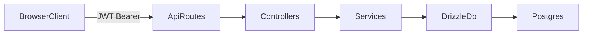

# Application Architecture

## Overview

This project is a two-tier web app (same shape as **workout-tracker-mini**):

- Frontend: React + Vite + Tailwind CSS in `client`
- Backend: Express + PostgreSQL in `server`

At runtime, the browser loads the React app and sends JSON requests to `/api/*`.

## Runtime Components

- **Browser Client**
  - Renders login, exercise, workout, and accessibility controls.
  - Stores JWT in localStorage for demo simplicity.
  - Sends API requests with `Authorization: Bearer <token>`.
- **Express Server**
  - Handles API routing with layered architecture:
    - routes -> controllers -> services -> db
  - Validates request payloads with Zod.
  - Enforces auth via JWT middleware on protected routes.
  - Enforces data ownership in service queries (`...where userId = req.user.userId`).
- **PostgreSQL**
  - Stores users, workouts, and exercises.
  - Accessed through Drizzle ORM.

## Core Data Flow

## Request Path Examples

- **Guest login**
  - `POST /api/auth/guest` -> `auth-controller` -> `auth-service` -> insert guest user -> sign JWT -> return token
- **List workouts**
  - `GET /api/workouts` -> `authMiddleware` -> `workout-controller` -> `workout-service.listWorkouts(userId)` -> DB query with owner filter
- **Create custom exercise**
  - `POST /api/exercises` -> `authMiddleware` -> `exercise-controller` -> `exercise-service.createCustomExercise(userId, ...)`

## Error Handling

- Server uses centralized error middleware (`server/lib/error-middleware.ts`).
- `ClientError` is used for expected HTTP-level errors.
- JWT auth failures are normalized to `401` responses.
- API responses are normalized to envelope shape (`data`/`error` + `meta.requestId`).
- Delete endpoints may intentionally return `204 No Content` for successful deletions.
- Envelope and error code contracts are shared across client/server via `shared/api-contracts.ts`.

## Security and Ownership Model

- Public routes are limited to auth entry points (`/api/auth/guest`, `/api/auth/sign-in`) and health checks.
- Protected routes require a valid JWT.
- User-owned data must always be queried/mutated with caller `userId`.
- Seed exercises (`userId = null`) are readable by all authenticated users.
- Custom exercises are only editable/deletable by their owner.

## Main Tables (Mini Domain)

- `users`: identity + display/accessibility preferences
- `exercise_types`: seeded global rows and user custom rows
- `workouts`: user-owned workouts referencing optional exercise

## Environment and Configuration

- `DATABASE_URL`: database connection string
- `TOKEN_SECRET`: JWT signing secret
- `CORS_ORIGIN`: allowed frontend origin(s)
- All are validated in `server/config/env.ts`

## Logging

- Application logs use structured JSON logging via `pino`.
- HTTP request logging is handled by `pino-http` middleware with request IDs (`x-request-id`).

## Build and Deploy Shape

- `pnpm run build` builds the frontend bundle.
- `pnpm run start` runs the server in production mode.
- Deployment target model: Vercel (client) + Render (API) + Neon (DB).
