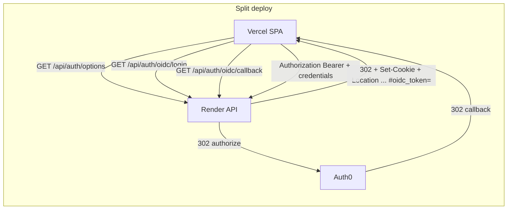

# Proposal: Auth0 OIDC (Path A) — build execution guide

This document is the **implementation playbook** for adding OAuth to `csci441-fitness-tracker`. It complements the detailed Cursor plan (`oauth_via_auth0_oidc` in Cursor plans) and the deployment checklist.

## Goal

Add **Auth0 OIDC** sign-in using the **workout-tracker** pattern: `openid-client` + PKCE, HttpOnly session cookies for OIDC handshake + optional session, **`#oidc_token=`** URL fragment for Bearer handoff on **Vercel + Render** split hosting. Keep **email/password sign-in** and **guest** behind **`AUTH_DEMO_ENABLED`** (default `true`).

## Non-goals

- bible-support–style `auth_accounts` / cookie-only session takeover.
- Account linking by email or guest→OIDC data migration.
- Auth0 RP-initiated logout or token revocation lists.

## Architecture snapshot

Browser abbreviations: the IdP redirects the **browser**; the callback URL is always on the **API host** (or localhost:5173 with Vite proxy).

## Environment invariants (enforce + document)

| Invariant                                                                                                                                                                                   | Where                                                    |
| ------------------------------------------------------------------------------------------------------------------------------------------------------------------------------------------- | -------------------------------------------------------- |
| `AUTH_OIDC_REDIRECT_URI` matches Auth0 **Allowed Callback URLs** exactly (trimmed, no stray newline).                                                                                       | `server/config/env.ts`, `docs/deployment/auth0-setup.md` |
| Split deploy: **`AUTH_OIDC_REDIRECT_URI`** origin = **API** (Render); **`AUTH_FRONTEND_ORIGIN`** = **SPA** (Vercel). Startup **warn** if both set and origins **equal** (likely misconfig). | `env.ts` after parse                                     |
| Production + split: `SESSION_COOKIE_SAME_SITE=none` **requires** `AUTH_FRONTEND_ORIGIN`; **`none` forbidden** when `NODE_ENV !== production`.                                               | `env.ts`                                                 |
| **`GET /api/auth/options`** is **public**, returns **`Cache-Control: no-store`**, body `{ oidc, demo }` in envelope — never behind `authMiddleware`.                                        | `oidc-auth-controller`                                   |
| **`AUTH_OIDC_ENABLED=false`**: `/api/auth/oidc/login` and `/api/auth/oidc/callback` → **404**; **`/api/auth/options`** → **200** with `oidc: false`.                                        | Controller routing                                       |
| **`AUTH_OIDC_ENABLED=false`** and **`AUTH_DEMO_ENABLED=false`**: no HTTP path obtains a session — document as invalid prod config unless intentional lockdown.                              | `docs/deployment/auth0-setup.md`                         |

## Build slices (order matters)

### Slice 1 — Server (vertical core)

1. Dependencies: `openid-client@^6` in `server/package.json`; `pnpm install`.
2. **`server/config/env.ts`**: new vars, trim helpers, Zod required-when matrix, `cookieSigningSecret()`, production SameSite rules, split-deploy origin warning.
3. **`server/app.ts`**: `trust proxy` in production.
4. **`server/lib/session-cookies.ts`** + **`server/lib/auth-types.ts`**: `ftrack_session`, `ftrack_oidc_login`.
5. **`server/lib/normalize-return-to.ts`**: relative path only; tests.
6. **`server/services/oidc-service.ts`**: discovery, PKCE authorize URL, code exchange, `upsertUserFromOidcProfile` (insert/update/race; no email auto-link).
7. **`server/controllers/oidc-auth-controller.ts`**: `options` (no-store), `login`, `callback`, `logout`; redirects; **no secret logging**; error enum `state_mismatch | idp_error | state_expired | internal`.
8. **`server/routes/api.ts`**: mount routes; **do not** wrap `/auth/options` with `authMiddleware`.
9. **`server/lib/authorization-middleware.ts`**: Bearer then cookie.
10. **`server/controllers/auth-controller.ts`**: gate guest/sign-in on `AUTH_DEMO_ENABLED`.
11. **`shared/api-contracts.ts`**: `AuthOptionsResponse`.
12. Tests: service, controller, middleware, normalize-return-to, demo 403; keep existing route tests green.
13. Gate: `pnpm run lint`, `tsc`, `test`, `build` from repo root.

### Slice 2 — Client

1. **`client/src/main.tsx`**: `bootstrapOidcFragment()` before `createRoot`.
2. **`client/src/App.tsx`**: fetch `/api/auth/options`; OIDC button clears **localStorage + React token state** before navigate; `credentials: 'include'` on API fetch; `logout` calls `POST /api/auth/logout` then clears storage; map `?auth_error=` to toasts.
3. **`client/src/test/handlers.ts`**: MSW for options + logout.
4. Client tests: fragment bootstrap; OIDC button clears prior token.
5. Gate: same quality commands + spot-check UI.

### Slice 3 — Deploy & docs

1. **`server/.env.example`**: full placeholder block; local `AUTH_OIDC_REDIRECT_URI=http://localhost:5173/api/auth/oidc/callback`.
2. **`render.yaml`**: new keys with safe defaults (`AUTH_OIDC_ENABLED=false`, `AUTH_DEMO_ENABLED=true`, secrets `sync: false`, etc.).
3. **`docs/deployment/auth0-setup.md`**: Auth0 URLs, env table, dev callback gotcha, dead-deploy note, 429/rate-limit troubleshooting.
4. **`docs/deployment/README.md`**, **`docs/deployment.md`**: env cross-links.
5. **`CHANGELOG.md`**: `[Unreleased]` entry.
6. Smoke: Auth0 tenant + Render + Vercel end-to-end.

### Slice 4 — Tests & regression (post-merge follow-up)

Fills gaps from Slice 1’s test list without requiring live Auth0:

1. **Route integration (`api.test.ts`):** OIDC login/callback **404** when `AUTH_OIDC_ENABLED=false`; **`POST /api/auth/logout`** success envelope.
2. **Demo gate (`auth-demo-gate.test.ts`):** `vi.mock('@server/config/env.js')` with **`AUTH_DEMO_ENABLED=false`** — `POST /api/auth/guest` and **`POST /api/auth/sign-in`** return **403**; **`GET /api/auth/options`** reflects **`demo: false`**.
3. **`authorization-middleware.test.ts`:** valid **Bearer** JWT; invalid Bearer **falls through** to **`ftrack_session`** cookie; unauthenticated throws **`ClientError`**.
4. Gate: root **`pnpm run lint`**, **`tsc`**, **`test`**, **`build`**.

### Slice 5 — API docs + Slice 2 client test completion

1. **`docs/api-overview.md`** / **`README.md`**: document **`GET /api/auth/options`**, OIDC routes, **`POST /api/auth/logout`**, Bearer **or** **`ftrack_session`** cookie, and `?auth_error=` behavior at a high level.
2. **Client:** `App.oidc-login.test.tsx` — **`Continue with Auth0`** clears **`wtmini.token`** and assigns **`location.href`** to **`/api/auth/oidc/login`** (hold **`/api/me`** hydration during the test so the sign-in panel stays mounted with a stale token).
3. Gate: same quality commands.

### Slice 6 — Deploy smoke script + mock-OIDC integration tests

1. **`scripts/smoke-deploy.mjs`** + **`pnpm run smoke:deploy`**: requires **`DEPLOY_URL`** = hosted **API** base URL (e.g. Render). Validates health, **`GET /api/auth/options`** no-store + `{ oidc, demo }`, and **401** without auth on sample protected routes.
2. **Tests:** **`server/services/oidc-service.test.ts`** — **`buildOidcCallbackUrl`**, **`exchangeOidcAuthorizationCode`** with **`openid-client`** mocked; **`resetOidcConfigurationCacheForTests`** for Vitest.
3. **`server/routes/oidc-flow.integration.test.ts`** — deterministic **`openid-client`** random helpers + mocked **`buildOidcAuthorizationRedirect`**, **`exchangeOidcAuthorizationCode`**, **`upsertUserFromOidcProfile`**; Supertest **login → callback** redirect with session cookie.
4. Gate: root **`pnpm run lint`**, **`tsc`**, **`test`**, **`build`**.

## Secrets and logging (hard rules)

- Never log: authorization `code`, OAuth `state`, `id_token`, `access_token`, issued JWT, `Authorization` header, raw `Cookie` header.
- Placeholders only in committed docs and `.env.example`.

## Rollback

- Flip **`AUTH_OIDC_ENABLED=false`** on Render; redeploy. Demo/guest remain if **`AUTH_DEMO_ENABLED=true`**.
- If both flags false, restore at least one auth path or rely on seed/manual DB access only.

## Implementation notes (repo-specific)

- **Vitest (client):** tests run with **`happy-dom`** instead of **jsdom** (`client/vite.config.ts`) to avoid ESM/worker startup issues in this environment; behavior under CI should match.
- **Fragment unit tests:** `client/src/lib/oidc-fragment.test.ts` covers bootstrap + hash stripping.
- **Drizzle Kit:** `server/drizzle.config.ts` aligns SSL handling with `server/db/pool.ts` so `drizzle-kit migrate` can reach Neon consistently.
- **OIDC service / full callback:** exercising **`openid-client`** discovery and token exchange still requires integration tests with a mock IdP or manual smoke; Slice 4 stops at HTTP-visible behavior + middleware + demo gate.
- **Slice 5:** closes the documentation gap and the Slice 2 checklist item for an OIDC button test; hosted smoke (Slice 3 §6) remains manual.
- **Slice 6:** scripted **`smoke:deploy`** automates part of Slice 3 §6 against **`DEPLOY_URL`**; full Auth0 browser login remains manual.

## Reference

- Cursor plan: `oauth_via_auth0_oidc` (same content as this proposal’s technical detail).
- Reference implementation: `workout-tracker` (`/workspace/workout-tracker`) — `oidc-auth-controller`, `oidc-service`, `session-cookies`, `main.tsx` fragment bootstrap.
